# 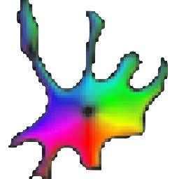 Cellpose for machine learning in image analysis
**Instructor**: Julie Mabon, Post-doc, Unité d'Analyse d'Images Biologiques, Institut Pasteur

> [!NOTE]
> In this course we use Cellpose 3[^cp3] instead of the latest Cellpose-SAM[^cpsam] as it is faster to run on any laptop and easier to re-train.

## 🧑‍💻 Getting ready

> [!WARNING]
> Be sure to have all tools installed as instructed in [Installation](./Installation.md)

## 🪄 Part 1: Cellpose-Appose on Fiji

**Use case:** Segment nuclei in the image, and count spot intensity in each nucleus, then export a CSV using the [Cellpose - Appose Fiji plugin](https://github.com/Image-Analysis-Hub/cellpose-appose).

1. Load the image
2. Launch the Cellpose plugin:
    - `Plugins > Segmentation > Cellpose-Appose > Cellpose...`
3. Set up parameters as suggested. You can hover your mouse over parameters to see what they do.

> [!IMPORTANT]
> - Choose appropriate `Cellpose Model`: here we use `nuclei` since we are segmenting nuclei; for cytoplasm use `cyto3`.
> - Set Cytoplasmic/Nuclei channel according to your image: here we don't have a cytoplasmic channel (→ None), and the nuclei staining is in channel 4
> - Make sure to check `return ROIs` to get ROIs in Fiji for our measurements

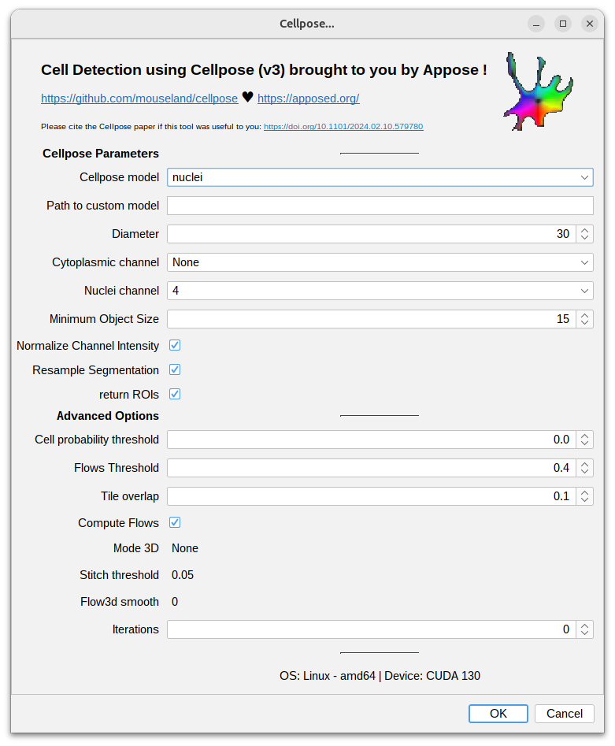

4. Click OK (it may take a while the first time to set up the Python environment)

> [!NOTE]
> The Python environment will be automatically installed in your home `.local/shared/appose` directory and activated from the plugin when needed.

5. Check the results. Check `Show All` in the `ROI Manager` to see all ROIs, `Labels` to show instance labels

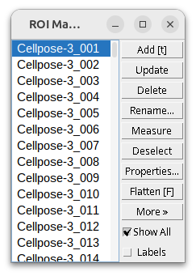

6. Now we are going to set up the measurements to extract for each nucleus ROI. Customize measurements in `Analyse > Set Measurements` (see documentation at https://imagej.net/ij/docs/menus/analyze.html#set) 

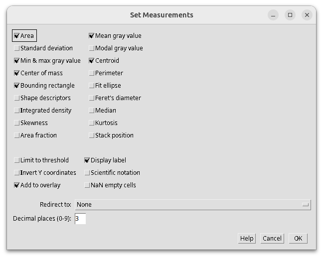

7. Select the spots channel (ch 3/4) since this is what we want to measure.
8. In `ROI Manager`, select all with `Ctrl+A` (`Cmd+A` on Mac). Then go to `ROI Manager > More > Multi Measure` and set as follows: 

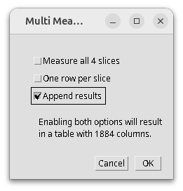

9. You should get something like this: one row per nucleus ROI, with measurements from channel 3. Save with `Results > File > Save As...`

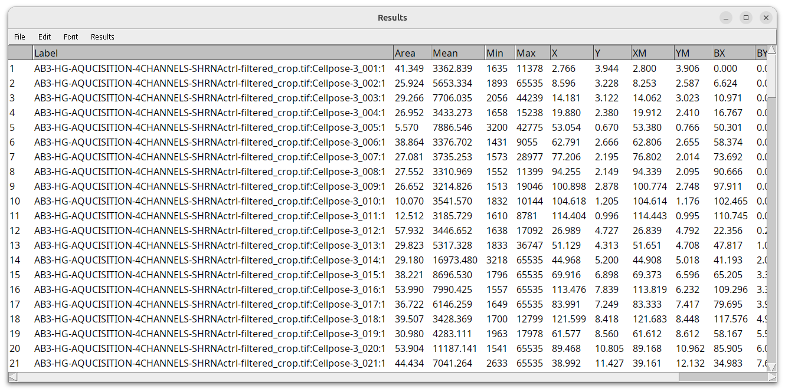

## 🎛️ Part 2: When it does not work out of the box

### Tuning diameter

Let's open [IBIDI.tif](./images/IBIDI.tif) and try to extract the nuclei

- Try nuclei detection with default `Diameter` = 30
  - (model=nuclei, cyto channel=None, nuclei channel=2)
- Update the diameter to fit the cells in the image and check results
- Try also with `File> Open Samples > Hela Cells`

Results on IBIDI.tif (diameter = 30)

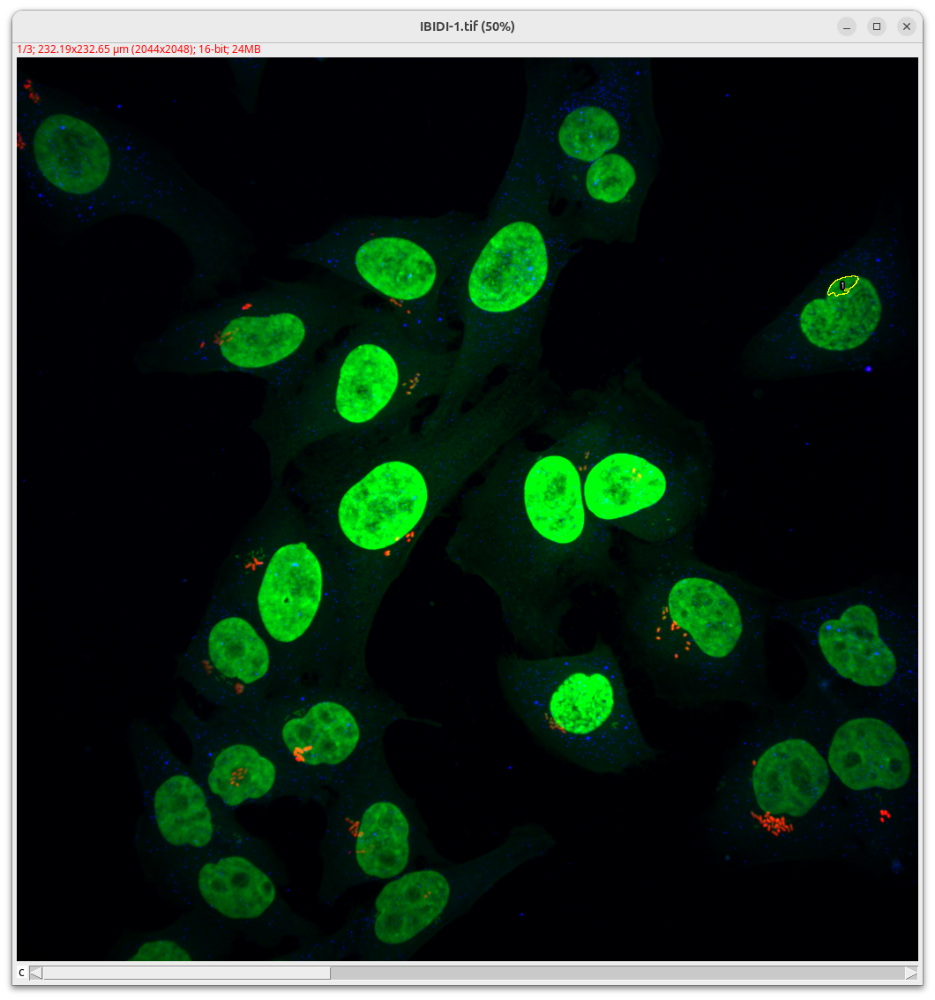

Results on IBIDI.tif (diameter = 200)

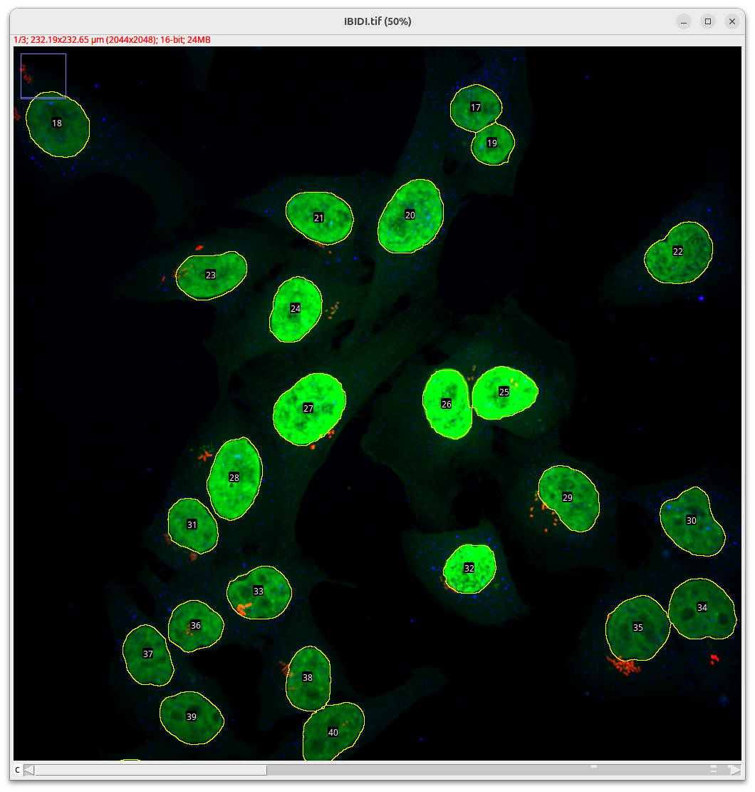

> [!TIP]
> You can use the line tool to measure your cell diameter in the image:
> 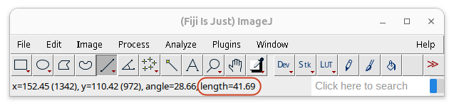
> Length is in µm, use `Ctrl+I` to display image info and get the pixel/µm
> 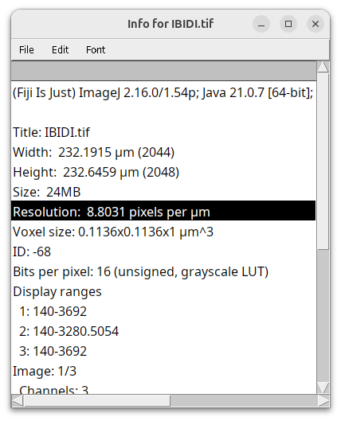
> Then you can get: cell diameter (px) = resolution (px/µm) × length (µm)

### Tuning contrast
Our [IBIDI.tif](./images/IBIDI.tif) also has information about the cytoplasm (DAPI + cellmask in the same channel), but the nuclei are very bright and the cytoplasm is very faint. Let's play around with the image contrast to get the cytoplasm!

- Try using the Retinex filter on the appropriate channel (non-linear contrast adjustment) 
- Tune the Cellpose parameters to segment the cytoplasm

### More if you have time
You can try 3D segmentation on [BMP4blastocystC3-cropped_resampled_8bit.tif](images/BMP4blastocystC3-cropped_resampled_8bit.tif).

> [!INFO]
> `Mode 3D`: `2D+stitch` performs 2D segmentation on each slice and stitches labels from each slices if there intersection over union (IOU) is above `stitch_threshold` (this is faster but sometimes imprecise); `3D` performs 2D inference on all XY, XZ, YZ slices and merges the estimated flows and cell probabilities (this is much slower but can sometimes improve results).

## 🏋️ Part 3: Fine-tuning using Cellpose-GUI

**Use case:** Let's work on images where Cellpose does not work out of the box and we need to fine-tune it on our images

Here we will try to improve the default detection from cyto3 to only extract the epithelial cells.

_from [^epi]_ 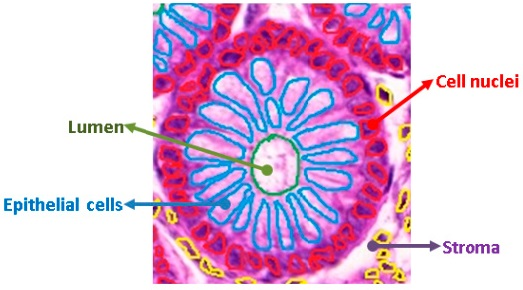

By default, Cellpose cyto3 over-segments but is not too far from our goal:

Results with cyto3

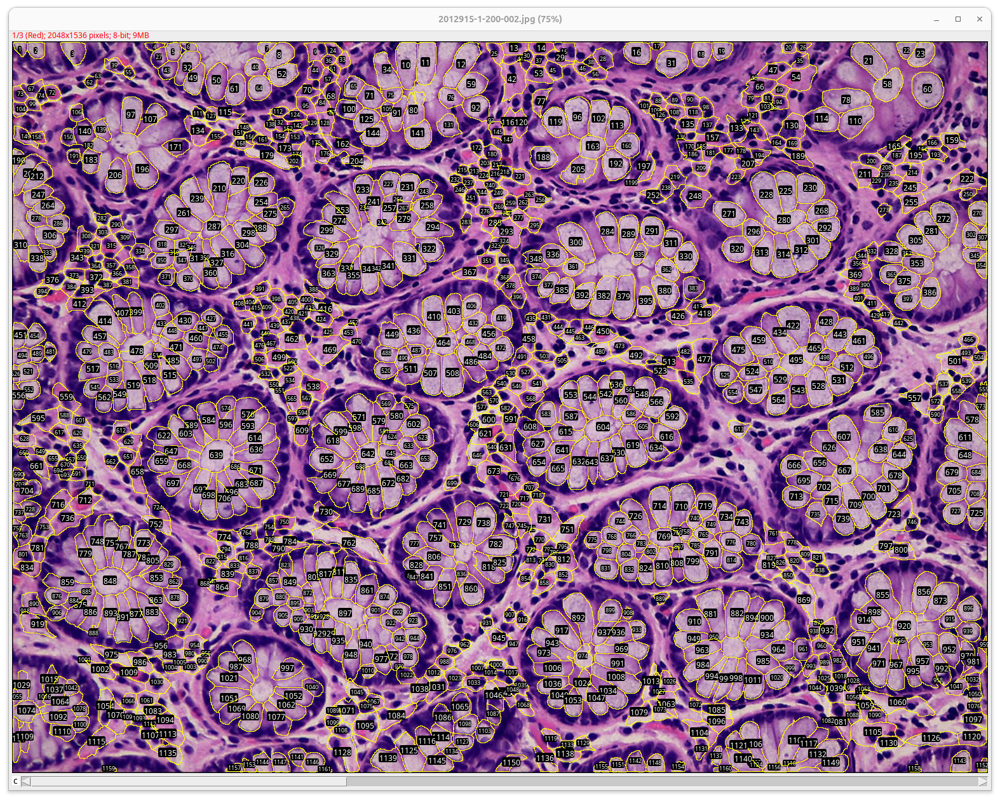

 

We want to fine-tune the model to get better results: 

Results with custom model

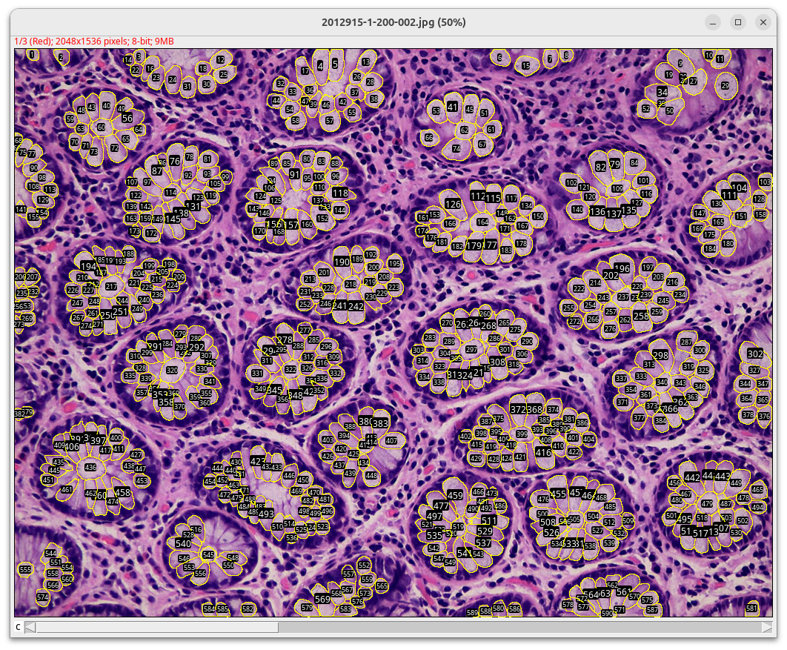

 

Data is located in [ECI/Day2_Cellpose/images/cp3_finetune](./images/cp3_finetune)

1. Prepare a crop of the first image (because correcting annotations on the whole image would be too long): open image on Fiji, draw a rectangle where to crop, then `Image > Crop`, `File > Save As > .Tif...` save in the same folder as the source image (e.g., as `<filename>_crop.tif`).

2. Open Cellpose GUI: In the `cellposegui` environment (make sure you ran `mamba activate cellposegui`), run `cellpose`. You should get something like this:
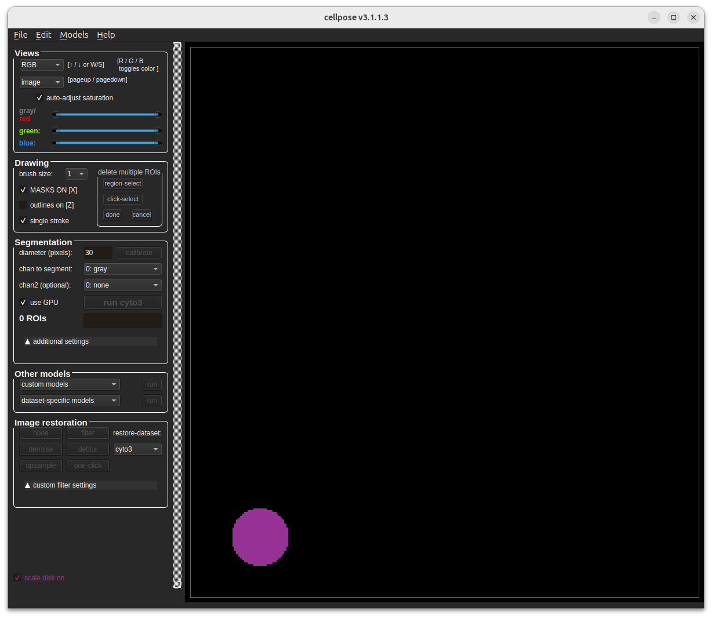

3. Load the crop by drag and drop or `File > Load Image`. Tune the diameter, set channel to use, then `run cyto3`.

4. Correct the segmentation:
    - `Ctrl+ left click` to delete
    - `Right click` to draw a new cell

5. Train a model on this patch: 
    - Models > Train new model with Images + masks in folder
    - Set up training
    - Run (it may take a while; monitor the progress in the terminal where you started cellpose from)
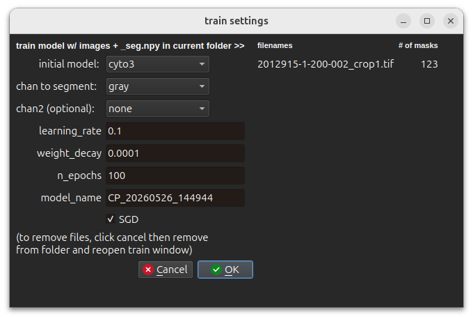
    
6. When training is done, the GUI goes on the next image in the folder and tries to segment it with your trained model. You can repeat steps 4-5 as needed to improve the results

7. Your model is stored in the image folder e.g., `my_images_folder/models/CP_20260526_144944`. You can reuse it within the Cellpose-Appose Fiji plugin with the `Path to custom model` field:
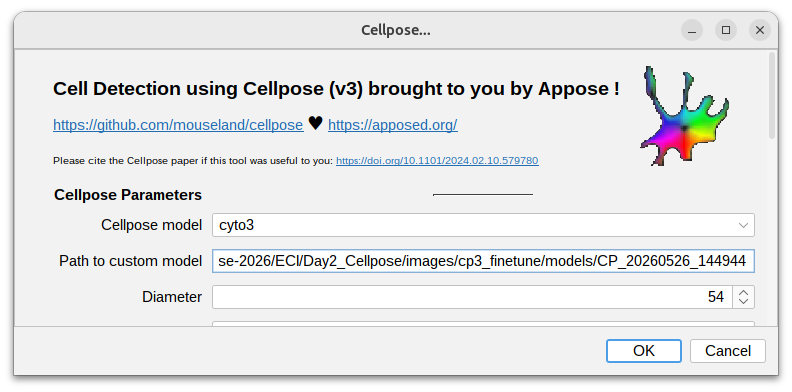

> [!INFO]
> You may need to convert the RGB image to a multichannel image before you run Cellpose: `Image > Colors > Channels Tool...` (alternatively `Ctrl+Shift+Z`) then change `Composite` to `Color` → OK

> [!TIP]
> The user input on the Cellpose GUI is not the most practical for extensive manual annotations. If you prefer using QuPath to annotate, [here](./export_labels_to_cp.groovy) is a small groovy script to export a ROI with all annotations inside as patch + masks in a cellpsoe compatible format.

## 📝 Take-home message

- For any biological image instance segmentation task, I suggest proceeding as follows until you get sufficiently good results:
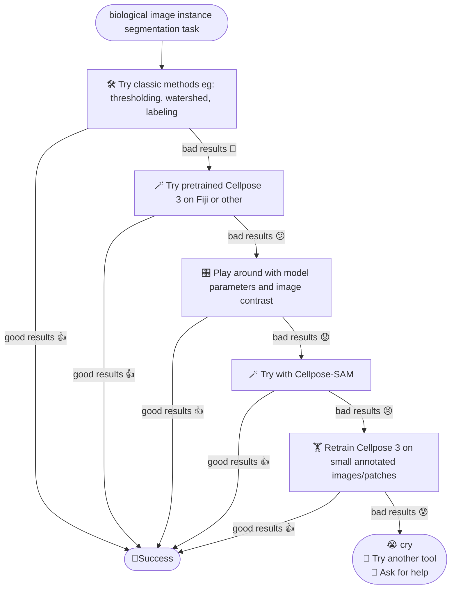

## 💽 Data
- [AB3-HG-AQUCISITION-4CHANNELS-SHRNActrl-filtered_crop.tif](./images/AB3-HG-AQUCISITION-4CHANNELS-SHRNActrl-filtered_crop.tif): crop + maxproj from https://zenodo.org/records/17048217
  > _3D confocal images of dorsal views of dissected telencephala from 4 months post-fertilization (mpf) zebrafish. Dataset of images to complement the paper: FishFeats: streamlined quantification of multimodal labeling at the single-cell level in 3D tissues. Bit depth for all images acquired was 16 bit, a tile scan of multiple Z stacks all with a voxel size of 0.207 µm × 0.207 µm × 0.5 µm. Immunohistochemistry (IHC) for Zo1 (Zonula occludens 1) outlines the apical cell contours, and IHC of Sox2 is used for the identification of neural stem cells and progenitor cells corresponding mostly to the first layer of cells. Expression of pcna, her4 and hey1 (in green, orange and red) were detected using fluorescent in situ hybridization (FISH)._
- [IBIDI.tif](./images/IBIDI.tif): From D. BROKATZKY, Pasteur - [Dynamics of Host-Pathogen Interactions](https://research.pasteur.fr/fr/team/dynamics-of-host-pathogen-interactions/)
  > chan0: DAPI and cell mask; chan1: Salmonella bacteria; chan2: NFKBIA RNA
- [BMP4blastocystC3-cropped_resampled_8bit.tif](images/BMP4blastocystC3-cropped_resampled_8bit.tif) 3D image
  > cropped and resampled image data from the [Broad Bio Image Challenge](https://bbbc.broadinstitute.org/BBBC032): Ljosa V, Sokolnicki KL, Carpenter AE (2012). Annotated high-throughput microscopy image sets for validation. Nature Methods 9(7):637 / doi. PMID: 22743765 PMCID: PMC3627348. Available at [http://dx.doi.org/10.1038/nmeth.2083](http://dx.doi.org/10.1038/nmeth.2083)

[^cp3]: Stringer, C. & Pachitariu, M. (2025). Cellpose3: one-click image restoration for improved segmentation. Nature Methods. https://www.nature.com/articles/s41592-025-02595-5
[^cpsam]: Pachitariu, M., Rariden, M., & Stringer, C. (2025). Cellpose-SAM: superhuman generalization for cellular segmentation. bioRxiv. https://www.biorxiv.org/content/10.1101/2025.04.28.651001v1
[^epi]: Rathore, S.; Iftikhar, M.A.; Chaddad, A.; Niazi, T.; Karasic, T.; Bilello, M. Segmentation and Grade Prediction of Colon Cancer Digital Pathology Images Across Multiple Institutions. Cancers 2019, 11, 1700. doi.org/10.3390/cancers11111700. Attribution 4.0 International (CC BY 4.0), https://commons.wikimedia.org/w/index.php?curid=83572639

