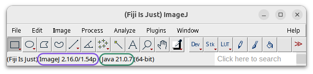

# Installation

## Part 1 & 2: Fiji and Cellpose-Appose

> [!WARNING]
> - Check you have the latest **Fiji/ImageJ** version with Java 21+
>   
> - If not, get it here: https://imagej.net/software/fiji/downloads

> [!IMPORTANT]
> Cellpose-Appose Fiji plugin installation
> 1. Go to `Help > Update... > Manage Update Sites > Add Unlisted Site`
> 2. Name it `Appose-Playground` and enter the address `https://sites.imagej.net/Appose-Playground`
> 3. Click `Apply and Close`, leave all `.jar` files checked
> 4. Click `Apply Changes`
> 5. Restart Fiji
>
> More info: https://github.com/Image-Analysis-Hub/cellpose-appose

## Part 3: Cellpose-GUI

> [!WARNING]
> Requirements
> - Make sure you have **Mamba** or **Conda** (type `mamba info` or `conda info` in the terminal to see version information). If not, install it from here: https://github.com/conda-forge/miniforge#install
> - Set up the Python environment:

> [!IMPORTANT]
> Installation of Cellpose in Python
> **Option 1** In the terminal:
> 1. Create the environment: `mamba create -n cellposegui python=3.12 -y`
> 2. Activate the environment: `mamba activate cellposegui`
> 3. Install the proper version of Cellpose: `python -m pip install 'cellpose[gui]'==3.1.1.3`, on windows you might need to use `pip install "cellpose[gui]"==3.1.1.3`
>
> **Option 2** Run `mamba create -f cellpose_env.yaml`
>
> You only have to do this **once**. Once the environment is set up, just run `mamba activate cellposegui` to activate.

> [!TIP]
> These instructions use `mamba`, but you can replace it with `conda` if you only have Conda installed.