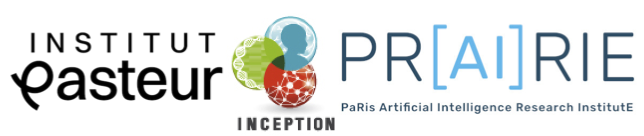

# Pasteur BioImage Analysis Course 2026

Monday June the 1st - Friday June the 5th 2026, Institut Pasteur, Paris, France

<td align="center">

 
</td>

## Course materials and preparation

<table>
  </tr>
    <tr>
    <td align="center">
      <b>ECI track</b>
    </td>
  </tr>
    <tr>
    <td align="center">
      <a href="ECI/Day1.md">Day 1</a>
    </td>
  </tr>
    </tr>
    <tr>
    <td align="center">
      <a href="ECI/Day2.md">Day 2</a>
    </td>
  </tr>
    </tr>
    <tr>
    <td align="center">
      <a href="ECI/Day3.md">Day 3</a>
    </td>
  </tr>
    </tr>
    <tr>
    <td align="center">
      <a href="ECI/Day4.md">Day 4</a>
    </td>
  </tr>
    </tr>
    <tr>
    <td align="center">
      <a href="ECI/Day5.md">Day 5</a>
    </td>
  </tr>
</table>

## Installation and preparation sheet 

Copy this on your laptop or print it to keep track of what you installaed and downloaded on your computer for the course.

- [Day 1](https://github.com/Image-Analysis-Hub/Pasteur-BioImage-Analysis-Course-2026/blob/main/ECI/Day1.md)
  - Fiji
    - [ ] Installed a [fresh version of Fiji](http://fiji.sc/)
    - [ ] Downloaded the materials for the Fiji tutorial - TBA
- [Day 2](https://github.com/Image-Analysis-Hub/Pasteur-BioImage-Analysis-Course-2026/blob/main/ECI/Day2.md)
  - Ilastik 
    - [ ] Installed [Ilastik](https://www.ilastik.org/download) 
    - [ ] Downloaded the [materials for the Ilastik tutorial](https://drive.google.com/file/d/1y-shYx_DuZfwHG0aGRI7c1BK_W8Ko0IX/view?usp=sharing)
  - Cellpose
    - [ ] Subscribed to the [Fiji-Cellpose update site](https://github.com/Image-Analysis-Hub/Pasteur-BioImage-Analysis-Course-2026/blob/main/ECI/Day2_Cellpose/Installation.md#part-1--2-fiji-and-cellpose-appose) in your freshly downloaded Fiji
    - [ ] Installed Python [Miniforge](https://github.com/conda-forge/miniforge#install)
    - [ ] Installed [Cellpose with mamba](https://github.com/conda-forge/miniforge#install)
  - Icy
    - [ ] Installed [Icy](https://github.com/icy-imaging/icy-bulk-installer) 
- [Day 3](https://github.com/Image-Analysis-Hub/Pasteur-BioImage-Analysis-Course-2026/blob/main/ECI/Day3.md)
  - QuPath
    - [ ] Installed [QuPath](https://qupath.github.io/)
    - [ ] Downloaded the [materials for the QuPath tutorial](https://zenodo.org/records/18302140)
- [Day 4](https://github.com/Image-Analysis-Hub/Pasteur-BioImage-Analysis-Course-2026/blob/main/ECI/Day4.md)
  - BiaPy
    - [ ] Subscribed to the [LOCI update](https://github.com/Image-Analysis-Hub/Pasteur-BioImage-Analysis-Course-2026/blob/main/ECI/Day4.md#1-install-fiji-and-plugins) site in your freshly downloaded Fiji
    - [ ] Downloaded the [materials for the BiaPy tutorial](https://drive.google.com/drive/folders/1mYLVetBEYlSIDjf7US-KZSPPosc2OrND?usp=sharing)
   - TrackMate
    - [ ] Downloaded the [materials for the TrackMate tutorial](https://dl.pasteur.fr/fop/WlrK2yFz/PasteurCourse-TrackMateTutorialsMaterials.zip)
- [Day 5](https://github.com/Image-Analysis-Hub/Pasteur-BioImage-Analysis-Course-2026/blob/main/ECI/Day5.md)

## Speakers, Teachers, and Helpers

- [Mélodie AMBROSET](https://eng-ur-bia.angers-nantes.hub.inrae.fr/) - UR BIA, INRAE, Nantes, France 
- [Lenka BACKOVÁ](https://scholar.google.com/citations?user=iDPf1qgAAAAJ&hl=en) - Image Analysis Hub, C2RI, Institut Pasteur
- [Carlos GARCIA-LÒPEZ-DE-HARO](https://github.com/carlosuc3m) - Universidad Carlos III de Madrid
- [Robert HAASE](https://www.uni-leipzig.de/personenprofil/mitarbeiter/dr-robert-haase) - ScaDS.AI Leipzig
- [Gaëlle LETORT](https://research.pasteur.fr/en/member/gaelle-letort/) - Developmental and Stem Cell Biology, Institut Pasteur
- [Vannary MEAS-YEDID](https://research.pasteur.fr/en/member/vannary-meas-yedid/) - Biological Image Analysis research unit, Institut Pasteur
- [Thomas MUSSET](https://research.pasteur.fr/fr/member/thomas-musset/) - Biological Image Analysis research unit, Institut Pasteur
- [Jean-Christophe OLIVO-MARIN](https://research.pasteur.fr/en/member/jean-christophe-olivo-marin/) - Biological Image Analysis research unit, Institut Pasteur
- [Thierry PÉCOT](https://biosit.univ-rennes.fr/ressources/faiia-centre-dintelligence-artificielle-et-danalyse-dimages-plateforme-de-biosit) - FAIIA, BIOSIT, Université de Rennes
- [Minh-Son PHAN](https://research.pasteur.fr/en/member/minh-son-phan/) - Image Analysis Hub, C2RI, Institut Pasteur
- [Stéphane RIGAUD](https://research.pasteur.fr/en/member/stephane-rigaud/) - Image Analysis Hub, C2RI, Institut Pasteur
- [Marcela RIVERA](https://research.abo.fi/en/persons/marcela-rivera-pineda/) - Jacquemet Lab, Turku University
- [Jean-Yves TINEVEZ](https://research.pasteur.fr/en/member/jean-yves-tinevez/) - Image Analysis Hub, C2RI, Institut Pasteur
- [Laura XÉNARD](https://research.pasteur.fr/en/member/laura-xenard/) - Image Analysis Hub, C2RI, Institut Pasteur

## Acknowledgement

